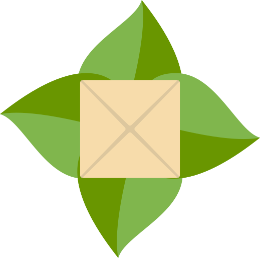

# Lembas

Lembas is a plugin management tool completely written in Rust for the game "Lord of the Rings Online". You may ask why we chose the name "Lembas"? Good question. For a succesful journey in LotRO you may need some plugins but definitely the famous lembas bread!

## Table of contents

## Installation

## Usage

## Screenshots

## FAQ

## Help

## Special thanks

I want to especially thank [@13r0ck](https://github.com/13r0ck) and [@hecrj](https://github.com/hecrj) from the [Iced zulip server](https://iced.zulipchat.com). Both were very helpful and their tips were essential for this app. I also want to thank [Thornbach](https://fungalmancy.netlify.app/) for the great icon.
